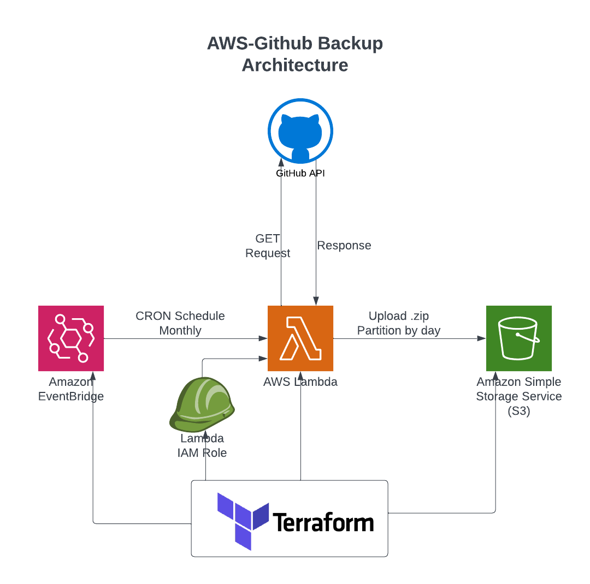
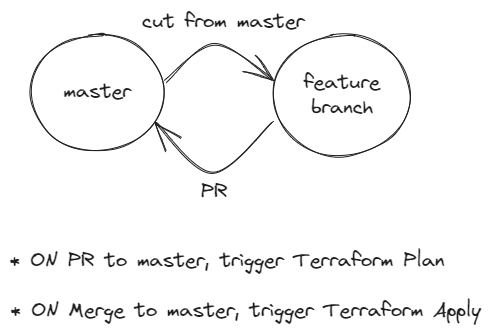

# github-backup-to-aws

This project is an automated backup to store all the github repostories from an account to an AWS bucket. It's probably a good idea to do the [Terraform Tutorial first](https://developer.hashicorp.com/terraform/tutorials/aws-get-started). The architecture looks like this:


# Step 1 - DONE

* Install `venv` to use a virtual environment on this project, when developing locally, it's important to create an isolate environment for each project so you can properly constrain the project dependencies. Take a look at [this guide to setup venv](https://www.digitalocean.com/community/tutorials/how-to-install-python-3-and-set-up-a-programming-environment-on-ubuntu-20-04-quickstart) and create a `venv` called `venv`.
* Always remember to activate this `venv` before developing your python code for this project.
* The `venv` folder should live at the root of this github project.

# Step 1.1

* [x] Create a file .env.example that contains the environment variables needed.
  | Variable | Description |OBS:
  | :------: | ----------- |:-----: |
  |TOKEN_GITHUB | Personal token to access user authenticated content from GitHub| [Documentation](https://docs.github.com/en/authentication/keeping-your-account-and-data-secure/managing-your-personal-access-tokens#creating-a-personal-access-token-classic)
  | BACKUP_ONLY_OWNER_REPOS | Define which repos to download. If only the ones that user is owner or colaborator too.|True or False

About BACKUP_ONLY_OWNER_REPOS, in an if statement almost every variable is considered "Truthy", excepted empty variables, None, False (boolean), and zeros. A lenghty explanation can be found [here](https://stackoverflow.com/questions/39983695/what-is-truthy-and-falsy-how-is-it-different-from-true-and-false) and [here](https://stackoverflow.com/questions/53198902/what-is-the-difference-between-none-and-false-in-python-3-in-a-boolean-sense#:~:text=This%20is%20because%20False%20is,have%20no%20value%20at%20all.)
But any string is considered True, unless it's a empty one. To `str:"False"` be considered `bool:False`, we needed to use `eval()`. But `eval()` won't work on `None` variables.

# Step 2.1 - DONE

 |

* Create a local python script that fetches all the github repositories from a account (both private and public), zips it and upload locally. You will need to read the [github public rest api documentation](https://docs.github.com/en/rest) to understand how to fetch this data from github.
* To access the GitHub via API you will need a personal token, this [documentation](https://docs.github.com/en/authentication/keeping-your-account-and-data-secure/managing-your-personal-access-tokens#creating-a-personal-access-token-classic) shows how to do it.

# Step 2.11 - DONE

* [x] Remove your `main` function, it doesnt do anything, it doenst receive any input to do calculations.
* [x] On your `get_metadata` function, you need to call the `filter_repository_by_owner` function. Note that, because of that, `get_metadata` must receive as input `owner_name`.
* [x] Now your `download_repos` function also must receive `owner_name` as input.
* [x] On your `download_repos` function, add the `owner_name` parameter
`owner_name = os.environ.get('owner_name', None)`. You will need this to pass in to the `download_repos` function.
* [x] Call the function `download_repos` at the end of the script instead of `main()`.

# Step 2.12

* [x] Create a function called `get_owner_name` that gets the user_name of the authenticated GitHub user. The documentation for the endpoint can be found [here](https://docs.github.com/en/free-pro-team@latest/rest/users/users?apiVersion=2022-11-28#get-the-authenticated-user)
* [x] Refactor your code to use the `get_owner_name` function with the following behaviour: Read the environment variable called `BACKUP_ONLY_OWNER_REPOS`, if this variable is not NULL, use `get_owner_name` to get the user name and input that to the `filter_repository_by_owner`. If `BACKUP_ONLY_OWNER_REPOS` is NULL, don't call the `get_owner_name` function and all the downstream calls to the `owner_name` variable will be skipped. Later we will try to fetch the variable `BACKUP_ONLY_OWNER_REPOS` from SecretsManager, if it's not there, we will assume it's null and follow the same flow described.
* Write test functions for new code always! You will need to use [patch](https://docs.python.org/3/library/unittest.mock.html) soon on new tests. Take a look at this example:

```python
from unittest import mock
from unittest.mock import patch
from urllib.error import HTTPError
import pytest
from ingestion.guru.client import GuruApiClient

@patch("requests.get")
def test_guru_client_check_for_response_errors(p_get_response):
    exception = HTTPError(url="", code=404, msg="not found", hdrs=None, fp=None)
    p_get_response.raise_for_status.side_effect = exception
    client = GuruApiClient(base_api_endpoint="", secrets_manager="", secret_path="")
    with pytest.raises(HTTPError):
        client.check_for_response_errors(response=p_get_response)
```

* After that, you can remove the variable `owner_name`, the user will not need to input that. Instead, he will need to input a variable called `filter_owner_repos_only`. If this variable is not `Null`, it will automatically filter the repositories that are owned by the github user.

# Step 2.2

* Once `2.1` is done, refactor your code to write the `.zip` files into an aws s3 bucket using [boto3](https://boto3.amazonaws.com/v1/documentation/api/latest/index.html) instead of writing the files locally on your machine.

# Step 2.3

* Once `2.2` is Done, create a lambda function on AWS Console with that logic and test it to see if it works.

# Step 2.4

* Once `2.3` is Done, Create that lambda using Terraform. (Create the Lambda Role using Teraform too). Ask Terraform to read a Secret on Secrets manager and pass those values to the lambda as Environment Variables.

# Step 3 - DONE/NOT_NECESSARY

* Create a python package containin your lambda code, so you can distribute it easily to other python projectcs (This will be important when start creating our test suite). Read this about [setup.py](https://www.geeksforgeeks.org/what-is-setup-py-in-python/) to build your package. Once you have it configure, just run `$ pip install -e .` on your virtual environment.

# Step 6 - DONE

* Create Terraform configuration to integrate this project to an AWS account. You will need to configure the following files:
  * `backend.tf`
  * `providers.tf`
* With those files configured, test locally if you cant perform a `$ terraform init` and `$ terraform plan` successfully. (you can deploy an anamazon S3 bucket to test if this is working via Terraform)

# Step 7 - DONE

* Create Github Actions to deploy our infrastructure automatically using [Gitflow](https://www.atlassian.com/br/git/tutorials/comparing-workflows/gitflow-workflow).


# Step 8 - DONE

* Create a lambda function (python code + infrastructure) and deploy it with terraform through the CI/CD Pipeline using [Github Actions](https://docs.github.com/en/actions).
* We should have three GitHub Actions in place for this project, which are equivalent to three `.yml` templates:
  * One `.yml` template that runs a `pytest` `on: pull_request` to branch `master`.
  * One `.yml` template that runs a `terraform plan` `on: pull_request` to branch `master`.
  * One `.yml` template that runs a `terraform apply` `on: push` to branch `master`.

# Stretch Goal

1) Refactor your python functions int a class that implements the Factory Pattern. Take a look at this article about the Factory Pattern, might give you an insight: <https://realpython.com/factory-method-python/>

1.1) Rewrite all your tests to comply with the new class created on 1)
